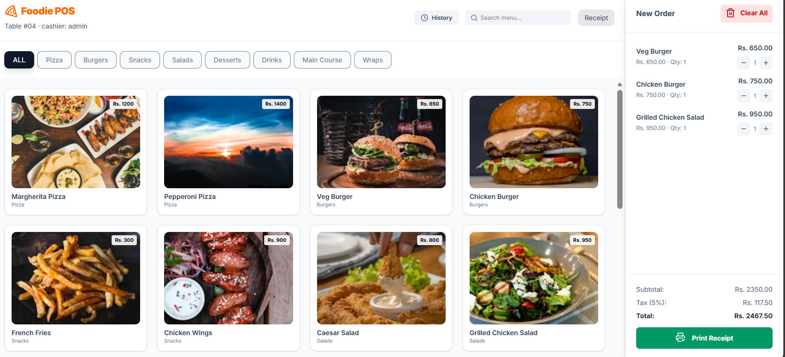
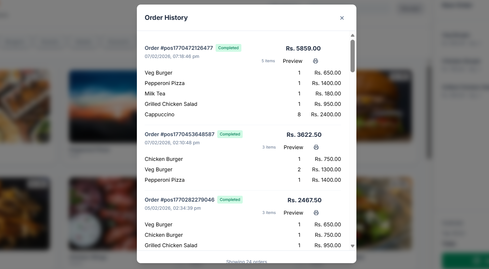
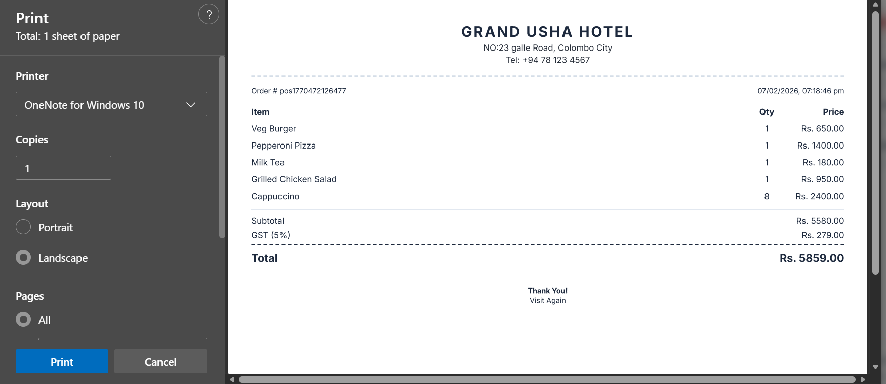

# Hotel POS System

A modern, fast, and responsive Point of Sale (POS) system designed specifically for hotels and restaurants. This application streamlines order management, cart management, and receipt generation with an intuitive user interface built with React and Vite.

## 📋 Overview

The Hotel POS System is a comprehensive solution for managing customer orders in hospitality establishments. It allows staff to efficiently browse menu items, manage customer carts, track order history, and generate professional receipts. The system features real-time category filtering, search functionality, and persistent order storage.







## ✨ Key Features

- **Interactive Menu Management**
  - Browse menu items organized by categories (Pizza, Burgers, Beverages, etc.)
  - Real-time search functionality to quickly find menu items
  - Category filtering for easy navigation
  - Product images and pricing displayed clearly

- **Shopping Cart System**
  - Add/remove items from cart with visual feedback
  - Quantity adjustment for each menu item
  - Automatic subtotal, tax calculation (5% tax rate)
  - Total price display with real-time updates
  - LocalStorage persistence for cart data

- **Order Management**
  - Complete order history tracking
  - Order details including order ID, date/time, and items
  - Order history persistence across sessions
  - View previously placed orders

- **Receipt Generation**
  - Professional receipt layout with hotel details
  - Itemized billing with price breakdown
  - Tax calculation and total display
  - Print-friendly format
  - Order-specific information printing

- **User Interface**
  - Clean, modern design with responsive layout
  - Tailwind CSS for styling
  - Lucide React icons for visual enhancements
  - Sidebar cart view with easy access
  - Mobile-friendly interface

## 🛠️ Technology Stack

- **Frontend Framework:** React 19.2.0
- **Build Tool:** Vite 7.2.4
- **Styling:** Tailwind CSS 4.1.18
- **Icons:** Lucide React 0.563.0
- **Language:** JavaScript (ES Module)
- **State Management:** React Hooks (useState, localStorage)
- **Linting:** ESLint

## 📁 Project Structure

```
hotel-pos/
├── src/
│   ├── components/
│   │   ├── CartSidebar.jsx       # Shopping cart display and management
│   │   ├── MenuTitle.jsx          # Menu item display card
│   │   ├── OrderHistory.jsx       # Order history view
│   │   └── Receipt.jsx            # Receipt generation and printing
│   ├── data/
│   │   └── menu.json              # Menu items database
│   ├── App.jsx                    # Main application component
│   ├── App.css                    # Application styles
│   ├── main.jsx                   # Application entry point
│   └── index.css                  # Global styles
├── public/                         # Static assets
├── package.json                   # Project dependencies
├── vite.config.js                 # Vite configuration
├── postcss.config.js              # PostCSS configuration
└── eslint.config.js               # ESLint configuration
```

## 🚀 Getting Started

### Prerequisites

- Node.js (v14 or higher)
- npm or yarn package manager

### Installation

1. Navigate to the project directory:

```bash
cd hotel-pos
```

2. Install dependencies:

```bash
npm install
```

3. Start the development server:

```bash
npm run dev
```

4. Open your browser and navigate to `http://localhost:5173` (or the URL shown in your terminal)

### Build for Production

To create an optimized production build:

```bash
npm run build
```

To preview the production build:

```bash
npm run preview
```

## 📝 Usage Guide

1. **Browse Menu Items**
   - Select a category from the top menu or view all items
   - Use the search bar to find specific items quickly

2. **Add Items to Cart**
   - Click any menu item to add it to your cart
   - Adjust quantities directly in the cart sidebar

3. **Manage Order**
   - View cart totals including tax calculation
   - Remove items as needed
   - Place order to save it to history

4. **Generate Receipt**
   - View receipt with itemized breakdown
   - Print receipt directly from the application
   - Receipt includes hotel details and order information

5. **View Order History**
   - Access previously placed orders
   - Reprint or reference past orders

## 🔧 Development

### Available Scripts

- `npm run dev` - Start development server with hot module replacement
- `npm run build` - Build optimized production bundle
- `npm run lint` - Run ESLint to check code quality
- `npm run preview` - Preview production build locally

### Code Quality

The project uses ESLint for code quality and formatting. Run the linter with:

```bash
npm run lint
```

## 💾 Data Persistence

The application uses browser LocalStorage to persist:

- **Cart Data:** Current shopping cart items and quantities
- **Order History:** All placed orders with timestamps

This ensures data is retained even after page refresh or browser restart.

## 📊 Menu Items

The system comes pre-loaded with sample menu items across multiple categories:

- **Pizza:** Margherita, Pepperoni, and more
- **Burgers:** Veg Burger, Chicken Burger, and options
- **Beverages:** Various drink selections
- **Desserts:** Sweet treats and desserts

Each item includes:

- Unique ID
- Item name
- Category
- Price
- Product image

## 🤝 Contributing

To contribute to this project, please follow these steps:

1. Fork the repository
2. Create a feature branch
3. Make your changes
4. Test thoroughly
5. Submit a pull request

## 📄 License

This project is provided as-is for educational and commercial use.

## 📧 Support

For issues, suggestions, or questions about the Hotel POS System, please contact the development team.

---

**Developed for efficiently managing point-of-sale operations in hotels and restaurants.**
